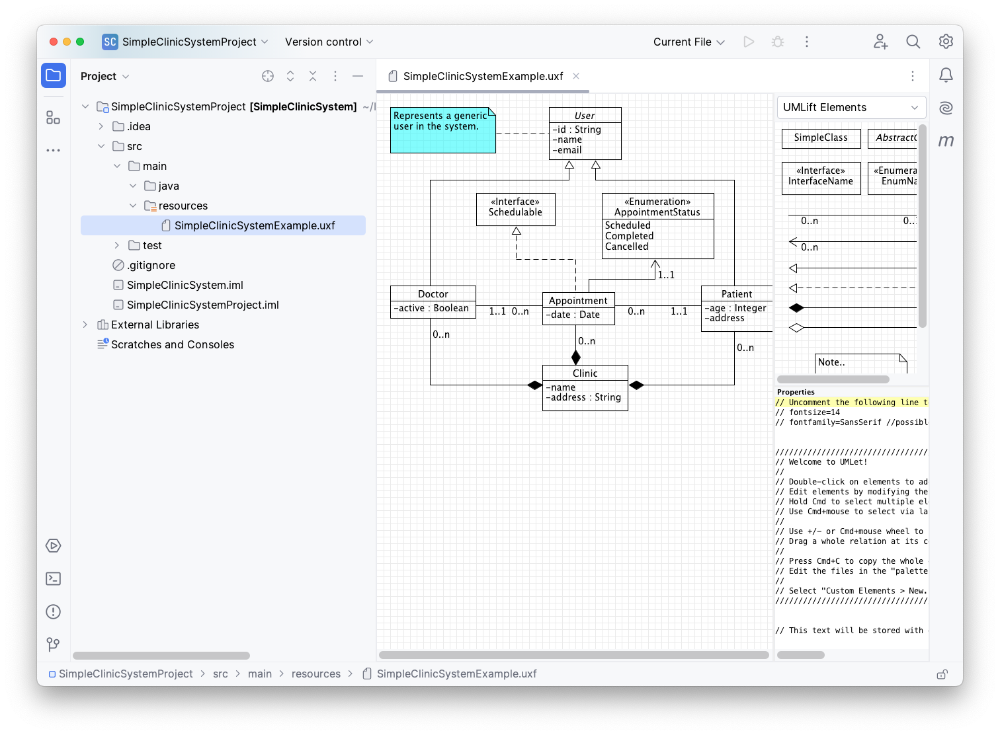
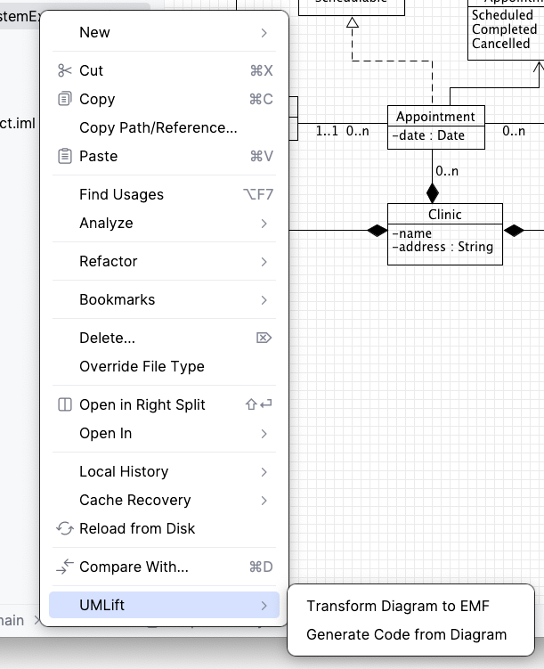
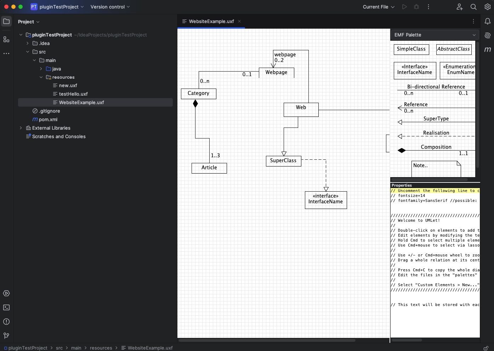
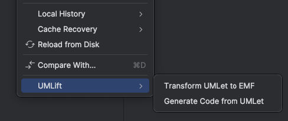
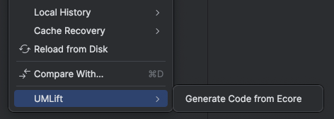
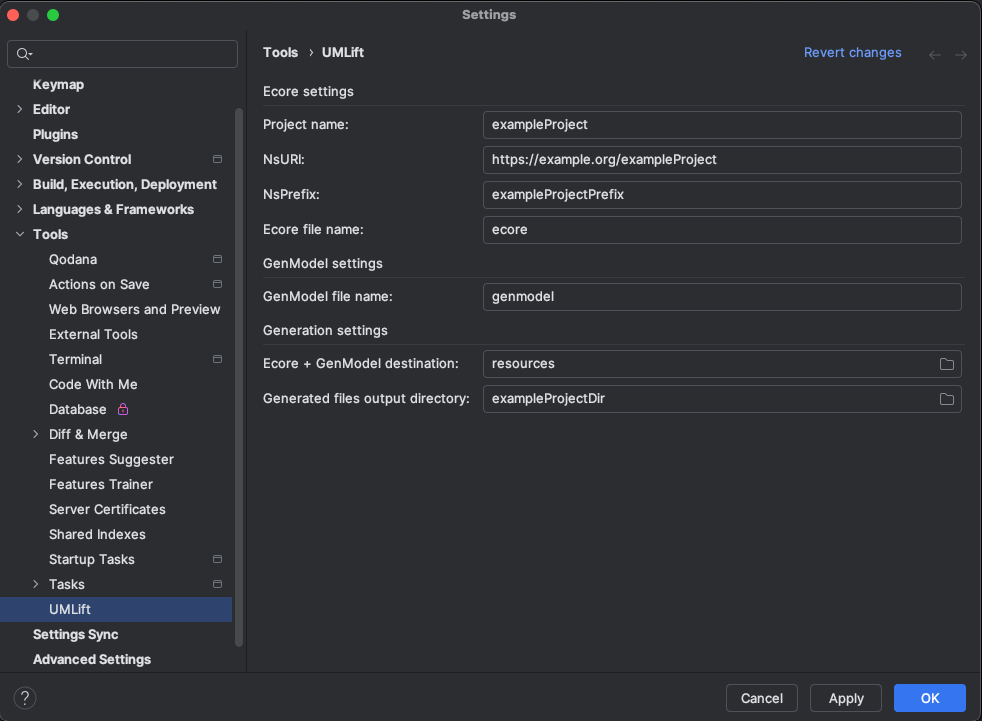

# UMLift - IntelliJ Plugin

This is a plugin for JetBrains IntelliJ IDEA. It provides facilities and tools for Informal Model-Driven Development (
MDD).

## Table of Contents

- [Overview](#overview)
- [Features](#features)
- [Installation & Setup](#installation--setup)
- [Usage](#usage)
- [License](#license)
- [Contact](#contact)
- [Back to Main Page](../README.md)

## Overview

Integrates UMLet GUI into the IntelliJ File Editor. Adds new context menu actions to provide the MDD functionality.
Configuration through IntelliJ's Settings Dialog.

## Features

- File Editor - integrated UMLet and its GUI, for UMLet Diagram files `.uxf`
- Context Menu Actions - to start transformation & code generation processes
- Progress Monitor - to indicate progress of running transformation & code generation processes
- Settings Dialog - to configure and customize the aforementioned processes

## Installation & Setup

### Get the Plugin from JetBrains Marketplace

- Install via JetBrains Marketplace: **Settings → Plugins → Browse Repositories → Search "UMLift" → Install**.

### Install it manually

Steps to install the plugin manually:

1. Run `mvn clean install` in the root of the project.
2. Go to the plugin's directory - `cd UMLift-IntelliJ-Plugin/`.
3. Run `./gradlew buildPlugin`.
4. Find the generated file at `build/distributions/UMLift-IntelliJ-Plugin-VERSION.zip`.
5. Open **Settings** and then select **Plugins**.
6. On the **Plugins** page,
   click 
7. Click **Install Plugin from Disk...**  
   
8. Select the plugin archive file and click **OK**.
9. Click **OK** to apply the changes and restart the IDE if prompted.

[Useful link](https://www.jetbrains.com/help/idea/managing-plugins.html?) to the official plugin installing guide.

## Usage

#### Opening UMLet Diagram Files

Simply double-click on any UMLet Diagram file - `.uxf`, or create a new `.uxf` file and a custom File Editor opens:

#### Generating code & artifacts from UMLet diagrams

1. Open your project in IntelliJ IDEA.
2. Right-click on a `.uxf` file in the Project view.
3. Choose **UMLift → Generate Code from Diagram**. 
4. Created Artifacts are placed in `src/main/java` or a configured output folder.
5. Ecore and GenModel files are created in `src/main/resources/EMFModels` or a configured output folder.

### Opening UMLet Diagram File - `.uxf`

Simply double-click on any UMLet Diagram file - `.uxf`, and a custom File Editor open:

### Using Context Menu Actions

#### UMLet Files

Right-clicking on an UMLet file - `.uxf` will open a Context Menu, where two actions will be available. 

#### EMF Files

Right-clicking on an EMF Ecore file - `.ecore` will open a Context Menu. 

#### Settings

UMLift's transformation and generation can be configured through IntelliJ's in-built Settings dialog. It can be found
under the `Tools` section. The changes are persistent, and can be Reverted back to the defaults.

## License

Distributed under the GNU General Public License v3.0. See [LICENSE](./../LICENSE.txt) for more information.

## Contact

Rastislav Vojtuš - [email me]()